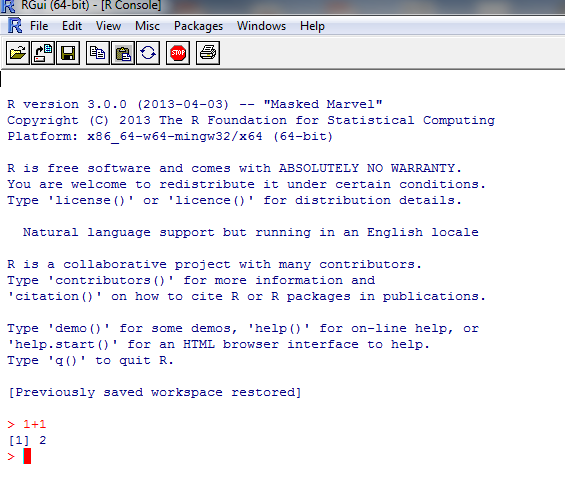
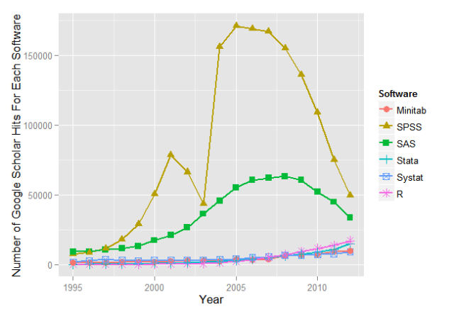
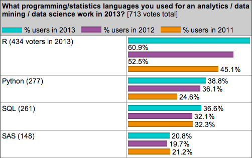
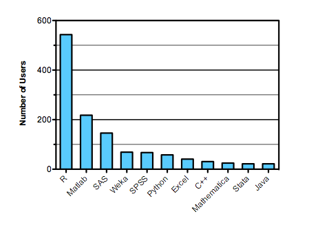
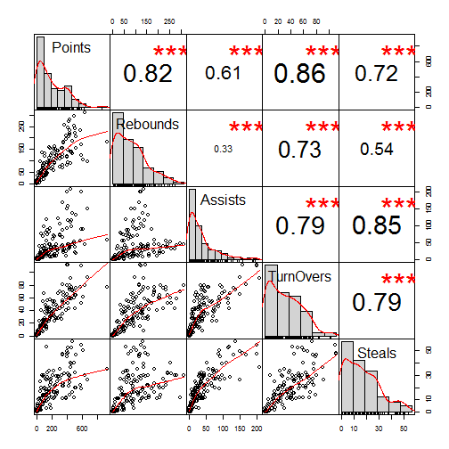
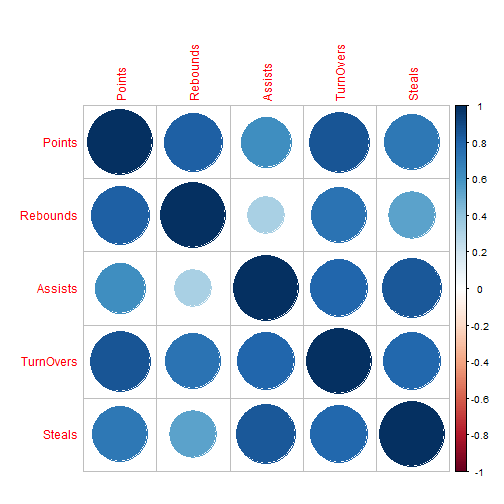
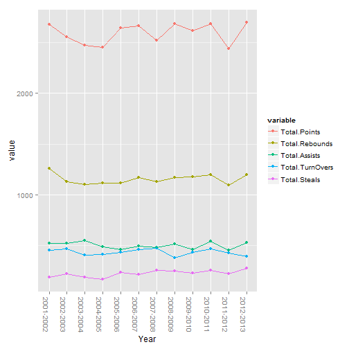
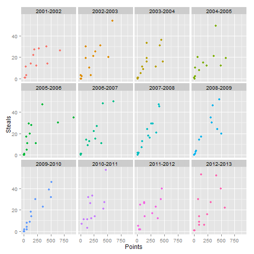

--- x:0 y:0 z:20 rotx:-40 roty:-10 rotz:30 

<br><br><br><br><br><br><br>

## Why **R** for Data Analysis? 
An SPSS/SAS Convert's View <br><br>
<super> Vivek H. Patil

--- x:-6000 y:2000 z:90 rotx:180 roty:-360 

## Agenda

<ol>
1. What is **R**? <br>
2. R versus other softwares <br> 
3. My embrace of R and a simple case 

--- x:-2000 y:0 z:0 rotx:-90 roty:-90 

## What is R?

 |  | 
---------|----------|---------
<ol>
1. A language and an environment for statistical computing and graphics<br>
2. Based on **S** - now owned by TIBCO <br>
3. Elegance - Language for statisticians by statisticians<br>
<a href="http://www.r-project.org" target="_blank"></a>

--- x:-8000 y:8000 z:0 rotx:-75 roty:-75

## Pluses

1. Free and Open Source -No reinvention of wheel and tinkering opportunities<br>
2. Coding in R - Reproducibility <br>
3. Most new routines appear in R before any other statistical system<br>
<center></center>
<supersub> Source: [Muenchen, Robert A, The Popularity of Data Analysis Software.] (http://r4stats.com/articles/popularity/), Retrieved 8/15/2013

---  x:-2000 y:-2000 z:-1000 rotx:45 roty:90 

## Pluses Continued...

4. Graphics - Great.... to ....Mindblowing<br>
5. Excellent package distribution system - Internet<br>
6. Compatible with most flavors of Unix, Mac OSX, and Windows<br>
7. Connectivity with most database systems, languages, applications<br>
8. Community support is outstanding - user-base estimates of 250,000-2 million<br>

<supersub> <a href= "http://www.nytimes.com/2009/01/07/technology/business-computing/07program.html" target= "_blank"> Ashlee Vance's NY Times story of 2009</a></small>


---  x:0 y:-4000 z:-2000 rotx:-40 roty:-10  

## Limitations

1. Command line interface <br>
2. Help - IDEs: R Studio, Revolution Analytics and - GUI: Deducer and R Commander<br>
3. Provides complete control over what happens but the learning curve could be steep<br>
4. Limited commercial support <br>
5. Acceptance limited because of limited understanding - e.g., Pfizer<br>
<center>

---  x:2000 y:-10000 z:500 rotx:-75 roty:75 

## Other Softwares - (SPSS, SAS, Stata,...)

1. Proprietory softwares, functions<br>
2. Algorithms developed for users - tinkering/customization ability limited<br>
3. Rectangular datasets and one at a time <br>
4. Expensive and costs escalate for additional options 

---  x:2000 y:2000 z:-1000 rotx:120 roty:-120 

## R versus Others


 | </td> 
---------|----------
<supersub>2013 KD Nuggets Poll    | <supersub>Kaggle Users 

<supersub> Source: [Muenchen, Robert A, The Popularity of Data Analysis Software.] (http://r4stats.com/articles/popularity/), Retrieved 8/15/2013 


---  x:2000 y:0 z:1000 rotx:70 roty:90
## R versus Others  - Jobs


 | </td> 
---------|----------

<supersub> Source: [Muenchen, Robert A, The Popularity of Data Analysis Software.] (http://r4stats.com/articles/popularity/), Retrieved 8/15/2013 


---  x:0 y:2000 z:2000 rotx:100 roty:-100 

## R Packages in Different Fields 

<iframe src="http://cran.r-project.org/web/views/" style="min-height: 700px; min-width: 950px;"></iframe>

<supersub> Source: From the R Project site

---  x:0 y:4000 z:-2000 rotx:-190 roty:190 

## Personal Journey

0. Pre-February 2013 - SPSS in Marketing Research and SPSS/SAS in design of Business Analytics
1. February 2013 (~ 7 months ago) - MOOC
2. April 2013 - R instead of SPSS in Marketing Research
3. Blogging 


---  x:10000 y:10000 z:-1000 rotx:-40 roty:30 

## Case Study

<iframe src="http://analyticsandvisualization.blogspot.com/2013/08/short-tales-of-two-ncaa-basketball.html" style="min-height: 700px; min-width: 950px;"> </iframe>

---  x:2000 y:4000 z:1500 rotx:190 roty:-190


```r
load("assets/Seasonstatisticscleaned.rda")
GUstats = subset(Seasonstatistics, Team == "Gonzaga Bulldogs")
dim(GUstats)
```

```
## [1] 155  20
```

```r
names(GUstats)
```

```
##  [1] "Player"                           "Minutes"                         
##  [3] "Field.Goals.Made"                 "Field.Goals.Attempted"           
##  [5] "Free.Throws.Made"                 "Free.Throws.Attempted"           
##  [7] "Three.Point.FieldGoals.Made"      "Three.Point.FieldGoals.Attempted"
##  [9] "Points"                           "Offensive.Rebounds"              
## [11] "Defensive.Rebounds"               "Rebounds"                        
## [13] "Assists"                          "TurnOvers"                       
## [15] "Steals"                           "Blocks"                          
## [17] "Year"                             "Team"                            
## [19] "City"                             "Conference"
```

```r
GUstats = GUstats[c(1, 9, 12:15, 17)]
GUstats[1, ]
```

```
##            Player Points Rebounds Assists TurnOvers Steals      Year
## 3760 Kelly Olynyk    571      235      55        77     22 2012-2013
```


---  x:4000 y:4000 z:2500 rotx:-180 roty:360


```r
corrmat = cor(GUstats[c(-1, -7)])
corrmat
```

```
##           Points Rebounds Assists TurnOvers Steals
## Points    1.0000   0.8173  0.6111    0.8572 0.7171
## Rebounds  0.8173   1.0000  0.3292    0.7324 0.5367
## Assists   0.6111   0.3292  1.0000    0.7912 0.8451
## TurnOvers 0.8572   0.7324  0.7912    1.0000 0.7899
## Steals    0.7171   0.5367  0.8451    0.7899 1.0000
```

---  x:4000 y:-4000 z=1000 rotx:20 roty:15


```r

library(PerformanceAnalytics)
chart.Correlation(GUstats[2:6])
```

 

---  x:-4000 y:-4000 z=200 rotx:200 roty:150

```r
library(corrplot)
corrplot(corrmat)
```

 


---  x:-4000 y:-30000 z=200 rotx:200 roty:150

```r
library(healthvis)
pairedVis(GUstats)
```

<iframe width="900" height="800" src="http://healthviz.appspot.com/embed/hs_108001" frameborder="0"></iframe>

---  x:-4000 y:4000 z=-1000 rotx:2000 roty:1500 


```r
library(plyr)
sumcomponents = ddply(GUstats, .(Year), summarize, Total.Points = sum(Points), 
    Total.Rebounds = sum(Rebounds), Total.Assists = sum(Assists), Total.TurnOvers = sum(TurnOvers), 
    Total.Steals = sum(Steals))
head(sumcomponents)
```

```
##        Year Total.Points Total.Rebounds Total.Assists Total.TurnOvers
## 1 2001-2002         2677           1259           522             453
## 2 2002-2003         2558           1127           520             466
## 3 2003-2004         2473           1102           548             404
## 4 2004-2005         2454           1113           486             409
## 5 2005-2006         2643           1118           460             431
## 6 2006-2007         2668           1169           492             462
##   Total.Steals
## 1          189
## 2          218
## 3          189
## 4          169
## 5          234
## 6          212
```

---  x:4000 y:-6000 z=100 rotx:120 roty:215 


```r
library(reshape2)
library(ggplot2)
GUstatsmelt = melt(sumcomponents, id = c("Year"))
ggplot(GUstatsmelt, aes(x = Year, y = value, color = variable, group = variable)) + 
    geom_point() + geom_line() + theme(axis.text.x = element_text(angle = -90))
```

 


---  x:4000 y:6000 z=1500 rotx:320 roty:415  


```r
library(rCharts)
hplot = hPlot(value ~ Year, data = GUstatsmelt, type = "line", group = "variable")
hplot$save("hplot.html")
```

<iframe src="hplot.html" width=975 height=800> </iframe>


---  x:6000 y:-4000 z=300 rotx:2000 roty:1511 


```r
ggplot(GUstats, aes(x = Points, y = Steals, color = Year)) + geom_point()
```

 


---  x:6000 y:-20000 z=6000 rotx:60 roty:90


```r

nvp2 <- nPlot(Steals ~ Points, data = GUstats, group = "Year", type = "scatterChart")
nvp2$xAxis(axisLabel = "Points")
nvp2$yAxis(axisLabel = "Steals")
nvp2$addControls("x", "Steals", names(GUstats))
nvp2$addControls("y", "Points", names(GUstats))
nvp2$addParams(width = 500, height = 400)
nvp2$save("nvdcontrols.html")
```

<iframe src="nvdcontrols.html" width=1200 height=800> </iframe>


---  x:6000 y:6000 z=360 rotx:2000 roty:180 


```r
ggplot(GUstats, aes(x = Points, y = Steals, color = Year)) + geom_point() + 
    theme(legend.position = ("none")) + facet_wrap(~Year)
```

 


---  x:0 y:-6000 z=400 rotx:2000 roty:150


```r
rp2 <- rPlot(Steals ~ Points | Year, data = GUstats, color = "Year", type = "point")
rp2$set(legendPosition = "none")
rp2$addParams(width = 500, height = 500)
rp2$addControls("x", "Steals", names(GUstats))
rp2$addControls("y", "Points", names(GUstats))
rp2$save("rp2.html")
```

<iframe src="rp2.html" width=1200 height=600> </iframe>


---  x:0 y:20000 z=400 rotx:40 roty:90


```r
d1 <- dPlot(x = "Steals", y = "Points", data = GUstats, groups = c("Player"), 
    type = "bubble")
d1$addControls("x", "Steals", names(GUstats))
d1$addControls("y", "Points", names(GUstats))
d1$set(storyboard = "Year")
d1$save("dimple.html")
```

<iframe src="dimple.html" width=1200 height=1000> </iframe>

---  x:8000 y:8000 z=8000 rotx:45 roty:-15 

## A Recently Released Video on R

From Revolution Analytics <br>  
<center>
<iframe width="640" height="360" src="http://www.youtube.com/embed/TR2bHSJ_eck?feature=player_embedded" frameborder="0" allowfullscreen></iframe>


---  x:8000 y:12000 z=8000 rotx:45 roty:-15 

## Final Thoughts and Possible Next Steps

1. R and its environment - flexible and powerful
2. Benefits to students
3. Setup resource center/support group(s) in school/campus
3. Financial Incentives??


---  x:12000 y:-8000 z=5000 rotx:90 roty:-90 

## References, materials borrowed from, and acknowledgements 
<supersub>
[Muenchen, Robert A, The Popularity of Data Analysis Software] (http://www.r4stats.com/articles/popularity/), Retrieved 8/15/2013 <br>
[Revolution Analytics blog] (http://www.blog.revolutionanalytics.com/)<br>
[Matthew Keller's Introduction to R ppt] (http://www.psych.colorado.edu/wiki/lib/exe/fetch.php?media=labs:learnr:lectures_and_homework:lecture1_sp2009.ppt)<br>
Hadley Wickham: ggplot2 <br>
Winston Chang: R Graphics Cookbook <br>
Ramnath Vaidyanathan: rCharts and slidify <br>
JS developers whose work used through rCharts in this deck - NVD3, Highchart, Dimplechart, and Polychart <br>
All the tireless developers providing resources in R and its libraries <br>
R Resources listing at my blog: http://analyticsandvisualization.blogspot.com  or http://analyticsandvisualization.com <br><br>
Sources of Images :<br>
John Chambers: http://www-stat.stanford.edu/~jmc4/CopyPhoto.jpg <br>
Ross Ihaka: https://www.stat.auckland.ac.nz/S-Workshop/small-ihaka.gif<br>
Robert Gentleman: https://www.stat.auckland.ac.nz/S-Workshop/small-robert.gif
